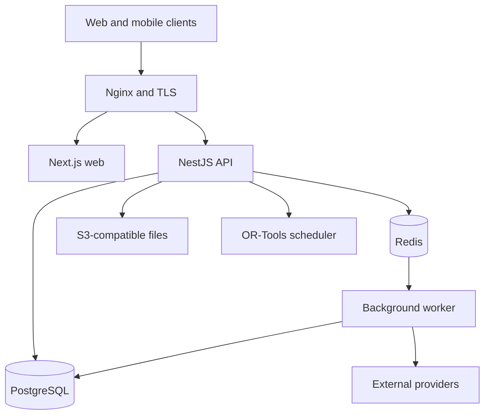

# Architecture and data design

## 1. Architecture decision

Use a TypeScript monorepo and modular-monolith backend. Separate deployables exist for operational reasons, but business modules remain in one codebase and one primary database until evidence requires more services.

### Recommended stack

| Layer | Choice | Notes |
| --- | --- | --- |
| Monorepo | pnpm workspaces + Turborepo | One lockfile, shared checks, cached builds |
| Public/admin web | Next.js App Router, TypeScript | SEO/public pages plus desktop administration |
| Mobile | Expo + React Native + Expo Router | One Android/iOS codebase; development builds, notifications, deep links |
| API | NestJS with Fastify adapter | Versioned REST, OpenAPI, validation, guards, WebSocket gateway |
| Jobs | NestJS worker + BullMQ | Communication, exports, PDFs, AI, publication, webhook retries |
| Scheduler | Python + FastAPI + Google OR-Tools CP-SAT | Bounded service for complex constraint optimization |
| Database | PostgreSQL + Prisma Migrate | Relational integrity and transactions; row-level security defense-in-depth |
| Real time | Socket.IO; Redis adapter when scaled | Broadcast only after authoritative database commit |
| Mobile storage | Expo SQLite + durable outbox; TanStack Query | Live-first writes with outage-safe game snapshot/mutations and regular query cache |
| Object storage | S3-compatible; MinIO in initial Docker stack | Waivers, exports, receipts, reports, images |
| Authentication | Better Auth with Expo client | Self-hosted TypeScript auth; domain authorization remains in API |
| UI | Tailwind/shadcn-style accessible web components; native Expo components; shared tokens | Share domain/contracts/tokens, not every UI component |
| Testing | Vitest/Jest, API integration tests, Playwright, jest-expo, Maestro, property tests | Add load/security/restore checks before production |
| Deployment | Docker Compose behind existing Nginx; GitHub Actions; EAS Build/Submit | Local Ubuntu pilot; move critical production services off a home/single server as risk grows |

Pin exact supported versions and document them when scaffolding. Prefer the current Active LTS Node version that is supported by the selected Next.js, NestJS, Prisma, and Expo releases.

## 2. Repository layout

```text
apps/
  web/                 Next.js public site and admin portal
  mobile/              Expo Android/iOS application
  api/                 NestJS authoritative API and Socket.IO gateway
  worker/              BullMQ processors and scheduled jobs
services/
  scheduler/           FastAPI + OR-Tools CP-SAT
packages/
  domain/              pure rules, state machines, permission policies
  contracts/           shared Zod schemas and event payloads
  sdk/                 generated OpenAPI TypeScript client
  database/            Prisma schema/client/migrations/seed helpers
  auth/                Better Auth integration and claims/session helpers
  ui-tokens/           color/type/spacing/icon tokens
  observability/       logging, tracing, error/report helpers
  test-utils/          factories, synthetic fixtures, clocks, tenancy helpers
infra/
  compose/             local/staging/production compose overlays
  nginx/               reverse proxy examples
  backup/              backup/restore scripts and runbooks
  monitoring/          health and alert configuration
docs/
execplans/
import/
.github/workflows/
```

Do not force the public/admin website through React Native Web. Share business logic, schemas, clients, and visual tokens while letting web and native use appropriate components.

## 3. Runtime topology



Only the reverse proxy exposes public ports. Database, Redis, object storage, scheduler, and management endpoints remain on private Docker networks. The API and workers are stateless apart from Postgres/files so they can scale horizontally later.

## 4. API and event boundaries

### Authoritative operations

- Versioned REST endpoints (`/api/v1`) with OpenAPI.
- Server validates authentication, organization membership, permission, input schema, state transition, current version, and business invariant.
- Database transaction commits authoritative state and an outbox/audit event.
- Generated SDK is used by web/mobile; CI rejects OpenAPI/client drift.
- Mutations that can retry accept an idempotency key.

### Real-time delivery

- Socket.IO authenticates the connection and authorizes room subscriptions.
- Game/public rooms receive accepted events or state projections only after commit.
- Reconnect requests events after a known version or receives a fresh projection.
- Redis pub/sub/adapter fans out across API instances later; Redis is disposable.

### Background jobs

Use jobs for email/SMS/push/social delivery, PDF/export generation, schedule solve requests, AI recaps, weekly releases, webhooks, statistics rebuilds, retention, and backup verification.

Every job has:

- tenant and actor/system context;
- stable idempotency/deduplication key;
- retry/backoff policy;
- timeout;
- structured result/error;
- dead-letter/failed-job visibility;
- trace/request correlation.

Use a transactional outbox for jobs caused by a database change so a commit cannot succeed while the required job silently disappears.

## 5. Multi-tenancy

### Hierarchy

- `platform`
- `organization` (commercial tenant/customer)
- `league` (sport/rules identity)
- `division` (optional grouping)
- `season`
- `team_season`

Put `organization_id` on all tenant-owned records, even when it can be inferred. Include it in important unique constraints and indexes. Set tenant context in each request/transaction. Use service-layer scoping plus PostgreSQL RLS as defense-in-depth. Automated tests must run using a non-owner database role because table owners can bypass normal RLS behavior.

Cross-tenant platform support access is explicitly granted, time-bounded, reasoned, and audited. Avoid per-tenant databases until contractual isolation or operational scale justifies them.

## 6. Authentication and authorization

- Better Auth manages identities, verified email/phone as configured, sessions, recovery, and MFA/passkey/OAuth capabilities selected for production.
- Mobile uses authorization-code/PKCE-compatible patterns and secure device storage; never embed a confidential client secret.
- Domain memberships/roles live in the application database, not solely in identity-provider claims.
- `Person` and `User` remain distinct because roster members may lack a login and guardians may manage several people.
- Authorization policies receive user, organization, role/permission, target resource, season state, and relevant relationship.
- High-risk actions may require recent reauthentication/MFA.

## 7. Core data model

Names below are conceptual; Codex may refine normalization while preserving invariants.

### Identity, tenancy, and governance

- `organization`, `league`, `division`, `season`
- `user`, `person`, `user_person_link`, `household`, `guardian_relationship`
- `organization_membership`, `role`, `permission`, `role_permission`, `membership_role`
- `governance_body`, `office`, `term`, `appointment_election`, `governance_decision`
- `feature_flag`, `organization_setting`, `branding`, `provider_connection`

### Teams, registration, and eligibility

- `affiliated_organization` (church or other sponsor)
- `team`, `team_season`, `team_application`, `application_answer`, `application_review`
- `team_staff_assignment`, `roster_membership`, `roster_change_request`
- `attestation_template`, `attestation_version`, `attestation_response`
- `eligibility_rule`, `eligibility_evaluation`, `eligibility_override`
- `public_profile_consent`

### Documents and signatures

- `legal_document_template`, `legal_document_version`, `legal_document_merge_field`
- `signature_packet`, `signature_requirement`, `signature_event`, `signed_artifact`
- `electronic_record_consent`, `verification_challenge`, `legal_hold`

Important uniqueness/invariants:

- content/render hashes identify exact versions;
- signed artifacts never update in place;
- one current satisfied requirement may point to one or more immutable historic signatures;
- signer, participant, relationship, tenant, team, and season are explicit.

### Facilities and schedules

- `venue`, `field`, `field_status`, `field_closure`, `field_emergency_plan`
- `availability_pattern`, `schedule_slot`, `team_blackout`, `official_blackout`
- `schedule_rule_set`, `schedule_constraint`, `schedule_run`, `schedule_candidate`
- `schedule_penalty`, `game`, `game_assignment`, `schedule_version`, `schedule_change`
- `schedule_fairness_ledger` (carries odd-team/undesirable-slot history between seasons)

### Game book and statistics

- `game`, `game_status_event`, `game_write_lease`
- `lineup`, `lineup_entry`, `substitution`
- `game_event` (append-only), `game_projection`, `game_snapshot`
- `scorebook_submission`, `game_attestation`, `game_amendment_request`, `game_version`
- `stat_definition`, `game_stat_line`, `season_stat_line`
- `standings_rule_set`, `standing_snapshot`, `tournament`, `bracket`
- `protest`, `ejection`, `incident`, `equipment_inspection`

### Finance

- `fee_definition`, `budget_scenario`, `budget_line`, `expense`, `vendor`
- `invoice`, `invoice_line`, `payment`, `refund`, `credit`, `settlement_reconciliation`
- `payment_provider_event`, `receipt_attachment`

Money uses integer minor units plus ISO currency; never floating point. Provider events and adjustments are idempotent and append-only/audited.

### Communications, weather, and media

- `communication_consent`, `notification_preference`, `suppression`
- `announcement`, `recipient_snapshot`, `message`, `delivery_attempt`, `acknowledgement`
- `weather_alert`, `weather_observation`, `safety_decision`
- `social_connection`, `social_publication`
- `media_outlet`, `media_contact`, `media_subscription`
- `ai_source_snapshot`, `ai_draft`, `ai_validation`, `publication`, `publication_approval`, `correction_notice`

### Platform assurance

- `audit_event`, `security_event`, `support_access_grant`
- `export_request`, `data_subject_request`, `retention_action`
- `webhook_event`, `outbox_event`, `job_result`

## 8. Game-event architecture

### Event envelope

```ts
type GameEventEnvelope = {
  organizationId: string;
  gameId: string;
  clientEventId: string;       // UUID created before local persistence
  expectedGameVersion: number;
  localSequence: number;
  eventType: string;
  payload: unknown;            // discriminated and schema-validated
  actorUserId: string;
  scorerAssignmentId: string;
  deviceId: string;
  occurredAtLocal: string;
  createdAtUtc: string;
  correctsEventId?: string;
};
```

Unique `(organization_id, game_id, client_event_id)` prevents duplicates. The server assigns authoritative sequence/version in a serializable or properly locked transaction.

### Live-first flow with offline failover

1. Before the game, the app downloads the official snapshot/event version, roster/rules, scorer lease, umpire assignment, and any time-bounded offline authorization. The UI reports whether the game is ready for offline failover.
2. Each action writes atomically to the local SQLite outbox before the UI marks it `Saved on device`; the local reducer immediately updates the scorer's view.
3. When connected, the sync process sends the event immediately with the expected version. Server acceptance is acknowledged to the scorer and broadcast live only after the authoritative transaction commits.
4. When disconnected, the same flow continues without blocking the scorer. Pending events remain durable and ordered.
5. The scorekeeper can create an offline end-of-game submission containing the complete event range, snapshot, hash, and local timestamp. It survives process/device restart.
6. The assigned umpire can attest offline on that device only using cached, time-bounded authorization tied to the game/umpire/device. Without that authorization, attestation waits until online; scorekeeper submission does not.
7. On reconnection, events, submission, and attestation upload in order. The server accepts/idempotently returns prior acceptance or rejects with an actionable conflict, credential, hash, or rule result.
8. Accepted events are marked/archived locally and broadcast in authoritative order. `Official final` is shown only after the server accepts the whole chain and umpire attestation.
9. If the scorer lease/version changed, the app presents reconciliation; events are never silently discarded or overwritten.

Test normal low-latency live scoring as the primary path, then intermittent service, airplane mode, process kill, app restart, duplicate retry, expired/offline authorization, scorer transfer, server restart, delayed events, offline submission/attestation, reconnect catch-up, and partial batch failure.

## 9. Scheduling engine design

Use OR-Tools CP-SAT because team/slot assignment is a binary integer constraint problem.

### Input contract

- organization/season/ruleset IDs and configuration versions;
- teams/divisions and prior-season fairness ledger;
- explicit available slots with date/time/field;
- locked games;
- opponent coverage/game-count rules;
- team/official/field restrictions;
- hard constraint configuration;
- integer weights for soft preferences;
- deterministic random seed and time limit.

### Variables and constraints

Model a binary variable representing an allowed matchup/home-away assignment in a slot. Add hard constraints for one game/slot, team overlap, totals, matchup bounds, locks, availability, and nightly limits. Model deviations for home/away, field/slot balance, repeat spacing, byes, conflicts, and doubleheader shape; minimize weighted integer penalties.

### Output contract

- status: optimal, feasible, infeasible, invalid, or time-limited/unknown;
- candidate games with slot/home/away;
- objective/penalty breakdown by rule/team;
- hard-constraint validation report;
- infeasibility hints based on staged constraint relaxation (never publish a relaxed-invalid schedule);
- solver/version/seed/runtime and input checksum.

Always revalidate a candidate in domain code before persistence/publication. Maintain property tests and golden schedules for 7–10 teams.

## 10. AI/media architecture

AI is isolated in the worker. It receives an `ai_source_snapshot` containing only public names allowed for the applicable game version, deterministic stats/box score, approved notes, style guide, and internal fact IDs.

- Use the OpenAI Responses API and Structured Outputs with Zod/JSON Schema.
- Set model through configuration; pin prompt/schema versions. Do not bury an exact model name throughout code.
- Use `store:false` or the approved data-control configuration when appropriate; never send private/minor/waiver/contact/medical data.
- Escape and delimit notes. Explicitly say notes are data, not instructions.
- Validate output schema and then fact-check every structured claim deterministically.
- Store raw output, validation, edits, and approval, but never expose raw model reasoning.
- No tool permission for the model to email/post/update games. Publication is a separate authorized application command.

Ordinary recaps run through the local BullMQ job. Background API mode is optional for longer weekly work; it does not replace the application's job/audit workflow.

## 11. Provider abstractions

Create narrow ports/adapters for:

- `EmailProvider`
- `SmsProvider`
- `PushProvider`
- `SocialPublisher`
- `PaymentCheckoutProvider`
- `ObjectStorageProvider`
- `WeatherProvider`
- `AiNarrativeProvider`
- `IdentityNotificationProvider`

Each adapter supports a fake/local implementation and records provider IDs/statuses without leaking provider-specific objects into domain entities. Social networks remain separate adapters because permissions and capabilities differ.

## 12. Initial deployment on Ubuntu

Compose services:

```text
nginx (or existing host Nginx)
web
api
worker
scheduler
postgres
redis
minio
```

Recommended environments:

- local developer: synthetic seed, Mailpit, fake SMS/social/payment;
- staging: separate domain/database/buckets and test provider accounts;
- production: separate secrets/data and explicit release approval.

Use non-root containers, read-only filesystems where practical, health checks, resource limits, restart policy, named volumes, migrations as a controlled release step, and a UPS for any on-premises production host. Avoid exposing home/server admin ports. A public league service should move to a reliable VPS/cloud or managed database/storage before commercial use or whenever local power/internet/recovery risk is unacceptable.

## 13. iOS and Android from Codex on Ubuntu

Codex in VS Code can create and maintain all Expo/React Native, Android, iOS configuration, tests, and EAS files. Android development builds/emulators can run locally on Ubuntu. Local iOS compilation/simulator use requires macOS/Xcode, but Expo EAS Build uses hosted macOS runners and EAS Submit can upload iOS builds from Linux. TestFlight/App Store review still requires an Apple Developer account and human review of privacy/store materials.

Recommended workflow:

1. Scaffold web/API/mobile together and share contracts from day one.
2. Test Android locally and both platforms through Expo development builds/physical devices.
3. Use EAS preview builds for internal testers.
4. Run Maestro smoke tests in EAS workflows.
5. Use EAS Build/Submit for signed binaries only after the release gate.
6. Get occasional Mac/Xcode access for native-only debugging and final iOS visual QA if needed.

Google AI Studio is not required. Keeping the full repository in Codex avoids two agents generating divergent architecture and contracts.

## 14. Scaling path

1. **Single league/pilot:** one Compose host, one database, feature flags hide commercial UI.
2. **First external leagues:** tenant onboarding, RLS enforcement, custom branding, provider connections, exports/deletion, formal SLO/DR, cloud/VPS production.
3. **Commercial growth:** managed Postgres/object storage, multiple API/worker instances, Redis adapter, CDN, billing, support tooling, per-tenant quotas.
4. **Only when measured:** partition high-volume game/audit tables, read replicas, dedicated tenants, extracted communications/scheduling services.

Do not introduce Kubernetes, event streaming, or database-per-tenant before real scale/contract requirements justify their operating burden.
