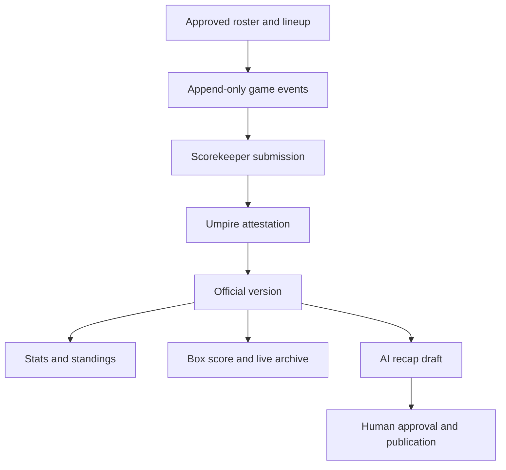
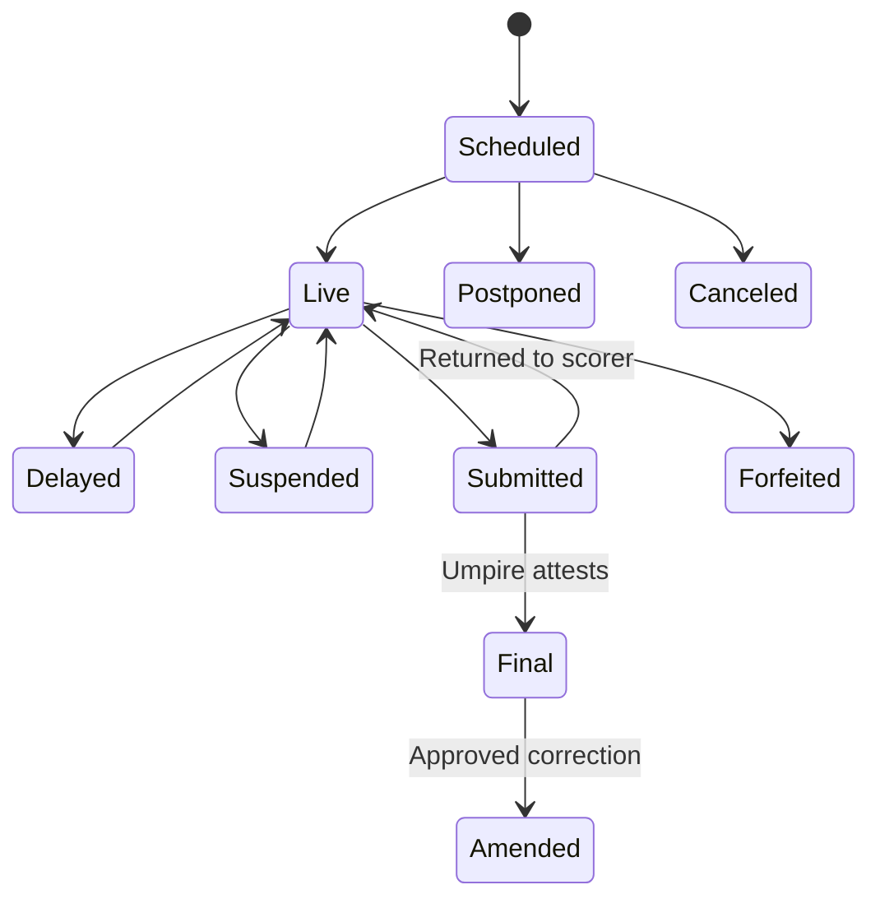

# Product blueprint

Research date: 2026-08-13

## 1. Product vision

Create one trusted operating system for a sports league—from team application through the final signed scorebook and season archive. The first tenant is the Meade County Church Softball League. The architecture must support other leagues later without making the first version difficult to operate.

The product should replace disconnected spreadsheets, paper packets, group texts, scorebooks, and manual press releases while preserving league control and a complete audit history.

### Primary outcomes

- A league officer can configure a new season without a programmer, even when playing days, fields, time slots, team count, rules, fees, or waivers change.
- A coach can apply, build a roster, see each player's eligibility, and know exactly what remains incomplete.
- A player or guardian can sign the correct current documents and retain a copy.
- A scheduler can generate, inspect, adjust, publish, and revise a fair schedule with an explanation of unmet preferences.
- An assigned scorekeeper records the game live whenever connected; each play is submitted and broadcast immediately. If connectivity fails, scoring and end-of-game submission continue safely on the device and synchronize automatically later.
- An umpire can review and attest to the exact final scorebook snapshot.
- Standings, player statistics, box scores, recaps, and weekly media material all trace back to the same official record.
- An authorized officer can send one weather/status update to the right people and public channels, with delivery tracking.
- The league can plan expected costs, track actuals, and understand its break-even fee/team count.

## 2. What makes this product different

Current products commonly combine registration, payments, schedules, rosters, and messaging. Detailed softball scorekeepers commonly add live play-by-play and statistics. Officials-management products commonly handle assignments and payment. This product's strongest opportunity is the trusted chain connecting all of them:

Every downstream output is reproducible. A correction creates a new approved version and automatically invalidates/rebuilds dependent outputs.

## 3. League-specific facts to preserve

These are current defaults for the first tenant. They must be configurable and versioned by season.

### Governance

- A three-member Board holds ultimate organizational authority.
- Elected President, Vice President, and Secretary/Treasurer handle day-to-day administration, rule interpretation, umpire setup, and schedules.
- Board members and elected officers are separate concepts, though a person may hold both roles.
- Overrides, rule changes, officer changes, and official-record corrections require attributable decisions and reasons.

### Team and roster eligibility

- Teams are tied to a church in Meade County or a bordering county.
- Players are members or faithful attendees in good standing, currently defined as at least two services per month.
- The roster is requested one week before the season and must be checked/approved before the team's first game.
- A church official and coach complete acknowledgements/certifications.
- Players under 14 are restricted to outfield, catcher, Extra Hitter, or designated/special runner.
- A pitcher must reach the configured minimum age by the configured season cutoff date (currently 18 by April 1).
- Coed lineup/composition, special runners, substitutions, home runs, pitching/strike-zone rules, safety rules, and tournament seeding must be represented as versioned rules rather than scattered code.

### Waivers

- Each participant or guardian signs a Meade County Parks/Fiscal Court waiver and a separate league-insurance waiver unless an approved consolidated document replaces them.
- The legal body of an approved waiver must remain unchanged. Only approved merge fields may vary.
- Waiver completion, guardian authority, version, and retained signed evidence affect eligibility.

### Scheduling

- Team count normally ranges from 7 to 10.
- Current goal: 10 games per team.
- Every team plays each other at least once; no pairing occurs more than twice.
- Target 5 home and 5 away games.
- Dates/days of week, fields, and time slots vary by season and even by week. The current example uses three slots in selected early weeks and two in later weeks.
- A team cannot be assigned simultaneously or play more than two games in one night.
- Doubleheaders should be consecutive and on the same field when possible.
- Field usage, early/late slots, byes, and repeat opponents should be balanced. With an odd number of teams, unavoidable imbalance should rotate across seasons.
- The kickoff-night and per-week game capacities are settings, not hard-coded week numbers.
- The system must retain the existing printable grid/export concept, including separate cells for the two team numbers.

## 4. Users and permission model

Titles are tenant-configurable labels over granular permission bundles.

| User/role | Main capabilities | Explicit limits |
| --- | --- | --- |
| Platform operator | Provision tenants, support, feature flags, platform health | No routine access to tenant waiver/player content; support access is time-limited and audited |
| Board member | Governance decisions, rule/version approval, officer changes, exceptional overrides | Does not automatically gain scorekeeper or finance entry rights |
| League officer/admin | Seasons, teams, eligibility, schedules, officials, ordinary rule interpretation | Sensitive overrides require reason and audit |
| Registrar/waiver admin | Applications, rosters, attestations, document completion | Cannot edit signed waiver content |
| Scheduler | Availability, constraints, schedule runs, manual locks, publication | Cannot silently change a published schedule |
| Finance officer | Budget, invoices, payment status, refunds/credits, exports | Cannot view full card data because the app never receives it |
| Umpire assigner | Availability, assignments, confirmations | Cannot alter official game events unless separately authorized |
| Scorekeeper | Assigned game lineup and event entry, submit book | One active official writer; cannot approve own post-final amendment unless separately authorized |
| Umpire | Review/attest assigned game; record official notes | Cannot rewrite scorekeeper history |
| Coach/team manager | Application, roster invitations, availability, lineup, team communications | Sees only authorized team/private fields |
| Adult player | Own profile, documents, schedule, stats, communication preferences | Cannot edit official stats or other players |
| Guardian | Managed minors, documents, public-data permissions, schedule, alerts | Cannot certify as umpire/scorekeeper without that role |
| Media approver | Review/edit/approve recaps and weekly releases | Cannot change underlying official facts |
| Media contact | Receives approved releases according to preferences | No internal portal privileges by default |
| Public viewer | Published schedule, standings, live scores, approved stats/news | No private roster/contact/waiver data |

Use permission policies, not UI hiding, to enforce access. Every sensitive endpoint receives organization context and a tested permission decision.

## 5. Application surfaces

### Public responsive website

- league home, news, rules, forms, contacts, field directions and canonical weather/status banner;
- schedules by league/team/date/field with calendar subscriptions;
- standings, finalized results, approved leaderboards, box scores, and live game pages;
- team application/registration entry point;
- privacy policy, terms, accessibility, account/data request, and notification preference pages.

### Web administration portal

- season wizard, configuration, facilities, fees, rule and waiver versioning;
- team applications, roster/eligibility dashboard, waiver completion, imports/exports;
- visual schedule builder and constraint report;
- scorebook review, amendment, standings/tournament controls;
- communications, weather decision console, media workflow;
- finance planning and actuals;
- officials, incidents, audit, reports, and tenant settings.

Complex grids, bulk edits, finance, and governance stay web-first.

### Android/iOS app

- personalized schedule, team roster, RSVP/availability, documents, alerts, directions;
- coach lineup and eligibility view;
- live scorekeeping with immediate fan updates, offline failover, clear synchronization status, and offline-capable book submission;
- umpire assignment, review, and attestation;
- live game following and push notifications;
- account, privacy, public-profile, and deletion controls.

The full admin portal does not need to be duplicated in mobile version 1.

## 6. Core capability modules

### 6.1 Tenant, league, and season configuration

- Organization → league → division → season hierarchy.
- Branding, timezone, terminology, privacy defaults, and public slug/domain.
- Season cloning that copies configuration but not signatures or payment completion.
- Effective-dated rulebook, forms, waivers, fees, stat definitions, standing/tiebreak rules, and notification templates.
- Draft/published/superseded/archive lifecycle.
- Feature flags and per-tenant provider connections.

### 6.2 Team registration and approval

- Configurable application form and capacity/deadline.
- Church/affiliated-organization record and authorized representative.
- Team fee/invoice, offline or hosted payment status, receipts.
- Coach acknowledgement and church-official certification.
- Review queue with missing-item checks, approve/reject/request changes.
- Registration snapshot retained after approval.

### 6.3 People, households, rosters, and eligibility

- A `Person` may participate without an app login; `User` is authentication; membership links them.
- Guardian/participant relationships and managed minor profiles.
- Season roster with jersey, league-defined lineup classification, eligibility dates, and roles.
- Individual invitations and duplicate-person detection.
- Configurable roster freeze; later changes require requests and approval.
- Eligibility engine returns reasons such as missing document, incomplete attestation, age/position violation, suspension, or unpaid required fee.
- Emergency/medical details are optional, encrypted, and visible only to explicitly authorized safety roles.

### 6.4 Digital waiver and document workflow

- Tenant-owned template and immutable version with checksum, effective dates, signer rules, merge-field allowlist, and source file.
- Separate electronic-record consent, ability to obtain paper copy, and accessible downloadable form.
- Adult self-sign or authenticated guardian sign with participant/relationship stated.
- Typed legal name and explicit intent-to-sign; optional drawn signature is supporting evidence only.
- Evidence includes document hash, rendered artifact hash, signer/user, participant, relationship, verification method, timestamps, IP/user agent, consent events, and delivery receipt.
- Final PDF/signing certificate delivered and retained.
- Withdrawal or supersession never deletes the historical signed record.
- Legal hold prevents retention jobs from deleting related records.

### 6.5 Cost planning, invoices, and actuals

- Scenario inputs: projected teams/players/games and registration/discount/sponsor revenue.
- Expense drivers: per-game umpire and scorekeeper fees; field/lights; insurance; balls/equipment; trophies; printing; software; communications; payment fees; contingency.
- Budget vs actual by season/category/vendor.
- Break-even registration fee and team-count scenarios, including 7–10 team capacity effects.
- Invoice, partial payment, refund, credit, receipt attachment, reconciliation status.
- CSV exports; this is an operational ledger, not a replacement for formal accounting.
- Hosted redirect checkout later; the application never stores card numbers or CVV.

### 6.6 Facilities and availability

- Venue, field, address, coordinates, timezone, shelter/emergency notes, permits, lighting, surface, status.
- Date-specific slots rather than assuming recurring days.
- Bulk rules for regular patterns plus exceptions/closures.
- Team/coach conflicts, special events, blackout dates, field restrictions, and maintenance.

### 6.7 Constraint-based scheduler

#### Hard constraints

- only available dates/fields/slots;
- no team in two games at once;
- configured maximum games per team per night;
- configured opponent minimum/maximum and total games;
- required divisional/opponent coverage;
- locked games remain fixed;
- eligibility of field/division/time and required rest limits;
- capacity and publication-state integrity.

#### Soft constraints with visible weights

- consecutive same-field doubleheaders;
- home/away balance;
- field, early/late, bye, and doubleheader balance;
- spacing of repeat opponents;
- avoid requested conflicts;
- equitable rotation of unavoidable odd-team exceptions across seasons;
- minimize changes when rescheduling a partial season.

The engine returns feasible candidates, an objective score, a penalty explanation, and an infeasibility report. Users can lock/edit games and regenerate only the remainder. Every run records input/configuration, deterministic seed, solver version, result, and actor. Draft and published schedules are versioned.

### 6.8 Officials

- Umpire/scorekeeper profile, availability, qualifications, conflicts, preferred locations, assignments, confirmations, replacements, and game fee.
- No Social Security number or tax ID in the core product. Future tax/payment needs use a qualified provider.
- Check-in, assignment reminders, and private performance notes with retention/access controls.

### 6.9 Game-day scoring

Use two scoring levels:

1. **Basic official mode (MVP):** lineup, substitutions, plate-appearance result, runner movement, outs, runs, hits/errors, inning transitions, special runner, status and official notes.
2. **Advanced mode (later):** pitch detail, fielding locations, richer situational and pitching metrics.

The MVP must be fast enough for a paper-scorebook user: large touch targets, undo as a correction event, clear inning/outs/bases, sunlight mode, and an unmistakable status showing `Saved on device`, `Live and synced`, `Pending sync`, `Submitted pending sync`, or `Official final`.

Every action is an immutable `game_event`. The server validates sequence, idempotency, permissions, game version, rules, and state transition in a transaction. Accepted state is then broadcast to spectators. Redis/WebSocket is not the official record.

#### Live-first operation with offline failover

1. Before game time, the mobile app downloads the game package: teams, eligible rosters, lineups/rules, assignments, last official version, and authorized offline credentials. A readiness check warns the scorekeeper before leaving reliable connectivity.
2. Every scoring action is first committed to SQLite on the device so it cannot be lost, then immediately sent to the API whenever connected.
3. After the server commits and acknowledges an action, Socket.IO broadcasts it to live followers. The scorer sees positive confirmation that the play is live.
4. If connectivity disappears, input never stops. Events remain in the ordered outbox and the public page retains the last synchronized state with a `Live updates temporarily interrupted` indicator.
5. At game end without a network, the scorekeeper can select `Submit Game Offline`. The app freezes a local review snapshot, hashes it, records the submission event, and preserves the complete package across app/device restarts.
6. The assigned umpire may review and attest on the same device while offline only when a valid, time-bounded offline authorization was cached before the game. Otherwise, the scorekeeper's submission remains pending and the umpire signs after connectivity returns.
7. On reconnection, the app automatically uploads game events, scorekeeper submission, and any umpire attestation in order. The server validates assignments, credentials, hashes, sequence, rules, and idempotency before accepting them.
8. A device may display `Attested offline — pending sync`, but the server/public record is not labeled `Official final` until all events and the umpire attestation are accepted. Followers then catch up in order.

### 6.10 Official game lifecycle

- Only assigned scorekeeper has the write lease; a league officer can transfer it with a reason.
- Suspended state retains inning, outs, count if tracked, runners, batting order, substitutions, score, and event sequence.
- Scorekeeper submits an exact book snapshot.
- Authenticated umpire reviews final score/status, protest/ejection flags, and attestation text; signing stores the snapshot hash and locks the version.
- A correction request references the original event/version. Authorized approval creates an amended version; prior versions remain readable to authorized users.
- Derived stats, standings, box scores, recaps, and press drafts are regenerated/invalidation-aware.

### 6.11 Statistics, standings, and tournaments

- Define stat formulas by sport/ruleset and version them by season.
- MVP batting: PA, AB, H, 1B, 2B, 3B, HR, BB, R, RBI, outs and configured derived percentages.
- MVP team/line score: runs by inning, total R/H/E, W/L/T, runs for/against, differential and streak.
- Pitching/fielding depth is a season option; do not promise statistics the scorer did not capture.
- Standings and tiebreakers are deterministic and display the applicable rule.
- Tournament pools, seeding, brackets, consolation, and double elimination are a later module built from published standings/rules.

### 6.12 Live public following

- Public or share-token live page; no account required unless tenant chooses.
- Score, inning/outs/base state, play-by-play, lineups where publicly permitted, and box score.
- Read-only fan connections; optional modest broadcast delay.
- Public privacy policy controls player display name/photo/stats, especially for minors.
- QR code per game and links from schedule/team pages.

### 6.13 Communications and weather

One `Announcement` is the canonical message. It has type, urgency, author, affected games/fields, recipient query, approved copy per channel, and release time.

Channels:

- in-app/status page (canonical);
- push;
- email;
- SMS;
- social Page adapters;
- manual copy/share fallback.

The system snapshots recipients, deduplicates, applies consent/preferences/suppression, sends through background jobs, records each attempt, retries safely, shows failures, and supports coach acknowledgement/escalation for urgent messages.

NWS forecasts/alerts are advisory. An authorized weather decision maker records the evidence, decision, affected scope, decision time, and next update. The software never auto-cancels.

### 6.14 AI game recap and weekly media release

1. Finalized public-data snapshot is produced by deterministic code.
2. A background job sends only that snapshot and approved notes to the OpenAI Responses API.
3. Structured Outputs returns headline, recap blocks, highlights, internal fact references, omissions, and validation status.
4. Code verifies every name, score, inning, and numeric claim against the snapshot.
5. A media approver sees the draft beside the source facts and edits/approves/rejects.
6. Approved game recaps roll into a weekly release with standings, leaders, and box scores.
7. Only an approved release can be emailed or posted. Delivery/publication is logged.
8. Any official amendment invalidates dependent drafts/releases and creates a correction workflow.

Prohibit invented quotations, injury speculation, criticism/accusations, confidential discipline/protest details, contact data, waiver data, medical data, and non-approved minor information. Treat all human notes as untrusted content, not instructions.

### 6.15 Safety, incidents, and discipline

- Injury/incident, ejection, protest, bat/equipment inspection, and disciplinary case are distinct confidential records.
- Public game status contains only approved facts.
- Access is least privilege; downloads and views are audited where appropriate.
- Rules link to the applicable official/local source version.
- Bat inspection can record pregame inspection, model, status, umpire/coach acknowledgement, and USA Softball reference. Do not attempt to infer legality only from a typed model name.

### 6.16 Reporting and archive

- Season packet and team-specific schedule/document exports.
- Eligibility/completion report; roster and waiver audit export.
- Schedule fairness/capacity report.
- Official game book, event log, attestation, amendments, box score, and stats export.
- Budget/actual and payment reconciliation exports.
- Communication consent/delivery report.
- End-of-season immutable archive plus portable tenant export.

## 7. MVP boundary

MVP means a safe, field-usable season system, not every sports-business feature.

### MVP includes

- foundation/tenancy/RBAC/audit;
- season configuration and public website;
- team application, rosters, eligibility, two waiver flows;
- facilities, flexible scheduling, publication/revisions;
- assignments, live-first basic scoring with offline failover/submission, live view, official attestation/amendment;
- core stats/standings/box scores;
- email/SMS/push-ready announcements, public status, NWS advisory feed;
- budget/actual planner and manual/hosted-payment-ready ledger;
- AI game recap draft with human approval;
- imports/exports, accessibility, backups, monitoring, and documentation.

### Later

- advanced pitch/fielding analytics and video/live streaming;
- open chat, direct minor communication, social feeds, photos/highlights;
- full official payroll/tax forms/background checks;
- practices, volunteers, concessions, store, tickets, sponsorship CRM;
- complex tournaments, multi-sport rulesets, multilingual UI;
- white-label native apps per tenant;
- platform subscription billing, connected tenant merchant accounts, custom domains;
- public API/webhooks, accounting integrations, and migration marketplace.

## 8. Product success measures

- 100% of active roster members show an explicit eligibility state before game one.
- Connected plays reach the live feed immediately after server acceptance, while no accepted or locally saved scorekeeping event is lost or duplicated in outage/retry tests.
- Every final score and stat can be traced to an official game version and event sequence.
- Schedule generator produces valid candidates for tested 7, 8, 9, and 10-team configurations or explains infeasibility.
- Weather/schedule updates reach the correct recipient snapshot with visible delivery results.
- No AI-produced numeric claim can publish without deterministic validation and human approval.
- A clean-server restore of database and files meets the documented recovery objective.
- A new season can be configured/cloned without source-code edits.
- No cross-tenant read or write succeeds in automated denial tests.

## 9. Product decisions deliberately deferred

These are not needed to start coding:

- commercial product name and final brand;
- SaaS price/plan design;
- custom-domain and white-label policy;
- exact payment, SMS, and email vendors;
- advanced stat package and streaming/video strategy;
- final legal retention periods and minor waiver enforceability;
- whether other sports are supported in the first commercial release.

Provider interfaces and configuration must make these choices replaceable.
